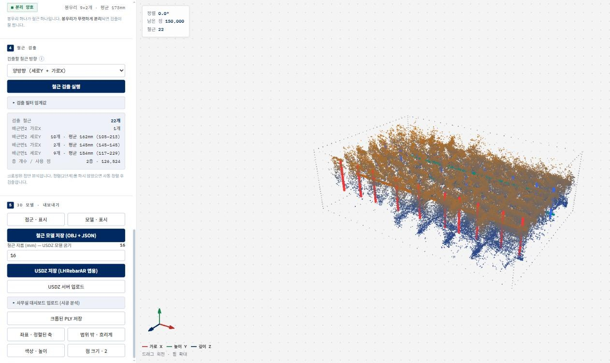

# LH Rebar Scan Analysis Tool (Web)

A single-file web tool that detects rebars in a LiDAR point cloud (PLY) and exports them as a 3D model (USDZ/OBJ).

*The tool after loading a sample scan (the public point cloud in [rebar-qc-dashboard](https://github.com/youngbrain85/rebar-qc-dashboard)), aligning the axes and running detection: 22 bars found in two layers.*

- **Use it at**: https://youngbrain85.github.io/lh-rebar-webtool/
- **Workflow**: the tool walks through five steps — load the point cloud, align the axes, crop, detect the rebars,
  and build and export the 3D model.
- The original source is `tools/ply-crop/index.html` in the private repository `lh-lidar-scan`; this repository is
  a copy for deployment on GitHub Pages (the only change is an added `<!doctype html>` line).
- All analysis runs inside the browser. The server (BriconLab) integration uses a plain-HTTP API, which browsers
  block on HTTPS pages, so if you need the server features, download the file and open it locally.
- The tool's interface is in Korean.
